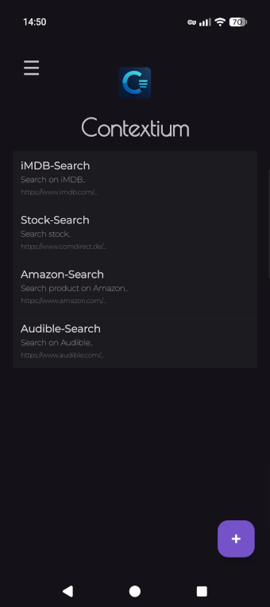
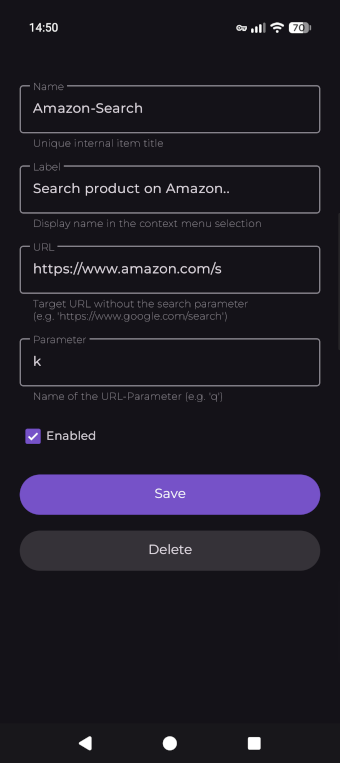
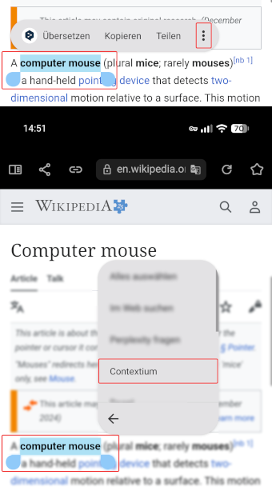
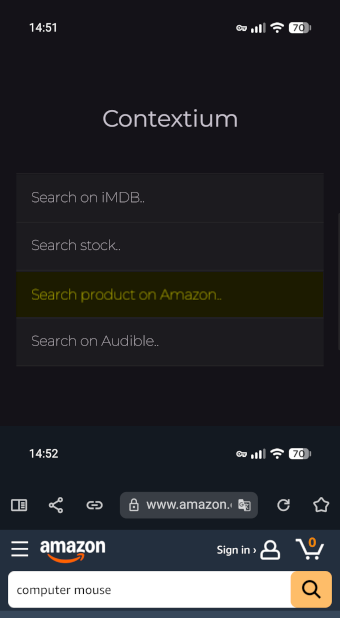

# Contextium

Contextium extends Android's native text-selection context menu with configurable actions for web
searches. Select text in apps (e.g. Browser), choose `Contextium`, and open the selected text with
one of your configured search URLs.

## Installation

Get the latest APK from the [Releases page](https://github.com/xcy7e/Contextium/releases/latest).

1. Download the APK.
2. Open it with your file manager and install it.
3. If prompted, allow your file manager to install unknown apps in Android settings.

## Features

- Add unlimited context-menu items
- Configure a name, label, target URL, and URL parameter for each item
- Reorder entries with drag'n'drop
- Enable/disable entries individually
- Access all configured entries from Android's native text-selection context menu
- Export and import your configuration as a backup

## How It Works

|                                   1. Add menu entries                                   |                              2. Configure each entry                              |
|:---------------------------------------------------------------------------------------:|:---------------------------------------------------------------------------------:|
|                            |  |
|                      **3. Select text, then choose `Contextium`**                       |                  **4. Choose an action to start the web search**                  |
|  |      |

### Requirements

The target website must support search terms passed as a URL parameter.

### URL and Parameter

Enter the target URL and the parameter name used by the website. Contextium automatically adds the
required separator (`?` or `&`), the equals sign (`=`), and the URL-encoded selected text.

### Examples

```yaml
# Example 1: URL without existing parameters
URL: https://www.google.com/search
PARAM: q

# Selected text: "foobar"
# Request URL: https://www.google.com/search?q=foobar
```

```yaml
# Example 2: URL with an existing parameter
URL: https://www.tradingview.com/chart/?x=y
PARAM: symbol

# Selected text: "FOO BAR"
# Request URL: https://www.tradingview.com/chart/?x=y&symbol=FOO%20BAR
```

---

## Weblinks
- Privacy Policy can be found [here](https://contextium.xcy7e.app/privacy) or in `PRIVACY.md` in this repository
