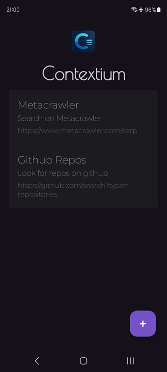
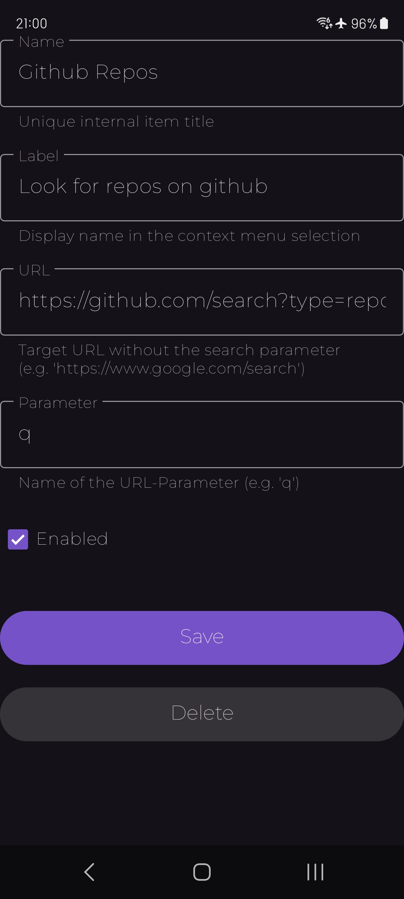
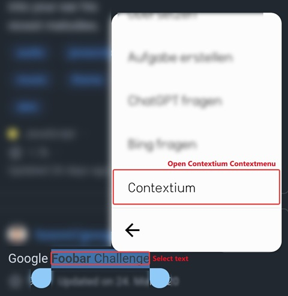
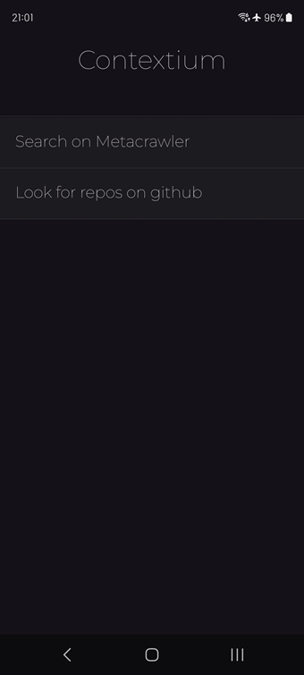

# Contextium

Contextium extends the Android-Contextmenu with individual configurable menu items to run web
searches. Select text in an App, choose \'Contextium\' and open the selection in your configured
URL.

## Install

You can find the newest version [here](https://github.com/xcy7e/Contextium/releases/).

1. Download the APK
2. Install the APK (you might need to allow installation of foreign apps in your phone's settings)

## How it works

|                                                                   |                                                                |
|:-----------------------------------------------------------------:|:--------------------------------------------------------------:|
|          Add unlimited context menu entries           |          Define name, label and the URL + parameter..          |
|                    |  |
|                                                                   |                                                                |
|            Open the native context menu > tap `Contextium`..             |   Select an item to perform  webrequest/search..    | 
|  |                |
